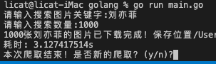
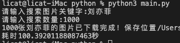

# 百度图片搜索下载

## 不同语言爬虫性能测试（爬取并下载保存1000张图片）
| 语言   | 结果                                   |
| ------ | -------------------------------------- |
| go     |      |
| python |  |

## go交叉编译命令
* ### Mac下编译Linux, Windows
```
# Linux
CGO_ENABLED=0 GOOS=linux GOARCH=amd64 go build

如: CGO_ENABLED=0 GOOS=linux GOARCH=amd64 go build -o baidu_img-linux main.go

# Windows
CGO_ENABLED=0 GOOS=windows GOARCH=amd64 go build

如: CGO_ENABLED=0 GOOS=windows GOARCH=amd64 go build -o baidu_img-windows main.go
```

* ### Linux下编译Mac, Windows
```
# Mac
CGO_ENABLED=0 GOOS=darwin GOARCH=amd64 go build

如: CGO_ENABLED=0 GOOS=darwin GOARCH=amd64 go build -o baidu_img-Mac main.go

# Windows
CGO_ENABLED=0 GOOS=windows GOARCH=amd64 go build

如: CGO_ENABLED=0 GOOS=windows GOARCH=amd64 go build -o baidu_img-windows main.go
```